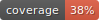

<p align="center">
  
</p>

<p align="center">
  
  
  
  
  <a href="https://github.com/facebook/openzl">
    
  </a>
</p>

## What is geozl?

OpenZL treats compression as a graph of codecs. Each frame carries the recipe needed to decode it, which lets a universal OpenZL decoder follow the graph without knowing how the data was originally encoded.

That model works well for one-dimensional streams, but it does not know that a raster has rows, columns, neighbours, or spatial structure. **geozl adds that missing spatial layer.**

A geozl codec is an OpenZL graph node that understands raster tiles. It transforms a typed numeric stream, stores the metadata needed to reverse that transform in the codec header, and lets the rest of the OpenZL graph continue as usual.

The full wire-level rules are described in [SPEC.md](SPEC.md). If you want to implement a new codec, see [docs/adding-a-codec.md](docs/adding-a-codec.md).

## Status

geozl is **experimental**.

The codec set, parameters, and header layouts may change between versions. There may be no migration path for old frames if the format changes, so pin the exact geozl version for any data you cannot regenerate.

> [!WARNING]
> **geozl codecs are not part of OpenZL.**
>
> They are registered at runtime as OpenZL custom transforms and use CTids in the `0x72D700`-`0x72D7FF` range. A frame that uses geozl codecs can only be decoded by a reader that has geozl registered. Frames that use only built-in OpenZL codecs remain portable OpenZL frames.

## Install

```bash
pip install geozl
```

## Example

geozl codecs are composed into an `openzl.ext` graph just like regular OpenZL nodes.

```python
import openzl.ext as zl
import geozl

c = zl.Compressor()
g = zl.graphs.Compress()

g = zl.nodes.Zigzag()(c, g)
g = geozl.lossless.Planar(width=512)(c, g)

c.select_starting_graph(g)
```

## Codecs

geozl currently provides two codec families:

- **near-lossless codecs**, under `geozl.lossy`
- **lossless codecs**, under `geozl.lossless`

Both families are registered as OpenZL custom codecs and can be chained with other OpenZL graph nodes.

The `call` column shows the Python call used to place the codec in a graph.

### Near-lossless codecs

Near-lossless codecs quantize the tile once, then store enough information in the frame to report and bound the reconstruction error.

A near-lossless frame is no longer bit-exact. Instead, it declares one error mode:

- **ABS**: a fixed absolute tolerance, useful for elevation, depth, coordinates, and similar values.
- **REL**: a fixed relative tolerance, useful for radiance, reflectance, SAR amplitude, and other values where percentage error matters.

| codec | call | CTid | mode | error |
|---|---|---:|---|---|
| `quant_linear` | `geozl.lossy.QuantLinear(max_error, dtype)` | `0x72D780` | ABS | every value reconstructs within `max_error` |
| `quant_log` | `geozl.lossy.QuantLog(rel_error, dtype)` | `0x72D781` | REL | every value reconstructs within `rel_error` of itself |

### Lossless codecs

Lossless codecs are bit-exact transforms over a raster tile. After decoding, the reconstructed tile is identical to the original input.

| codec | call | CTid | what it does |
|---|---|---:|---|
| `delta_w` | `geozl.lossless.DeltaW(width)` | `0x72D701` | stores each value as a difference from its west neighbour |
| `delta_n` | `geozl.lossless.DeltaN(width)` | `0x72D702` | stores each value as a difference from its north neighbour |
| `planar` | `geozl.lossless.Planar(width)` | `0x72D703` | predicts each pixel from `W + N - NW` |
| `deinterleave` | `geozl.lossless.Deinterleave()` | `0x72D704` | splits an interleaved complex stream into real and imaginary lanes |
| `med` | `geozl.lossless.Med(width)` | `0x72D705` | uses the median edge detector predictor |
| `average` | `geozl.lossless.Average(width)` | `0x72D706` | predicts from the floor average of west and north neighbours |
| `wp_static` | `geozl.lossless.WpStatic(width)` | `0x72D707` | fits a static weighted predictor and stores the weights in the frame |

## License

BSD-3-Clause

<div align="center">
  <br>
  Made with &#9829; by
  <br><br>
  <a href="https://asterisk.coop">
    
  </a>
</div>
