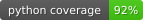

<p align="center">
  
</p>

<p align="center">
  
  
  
  
  <a href="https://github.com/facebook/openzl">
    
  </a>
  <a href="https://github.com/astral-sh/ruff">
    
  </a>
  <a href="https://mypy-lang.org/">
    
  </a>
  
</p>

## What is OpenZL and GeoZL?

[OpenZL](https://github.com/facebook/openzl) represents compression as a graph of codecs. Each compressed frame includes the information needed to decode that graph, which means a generic OpenZL decoder can follow the recipe without needing to know in advance how the data was encoded.

That works well for one-dimensional streams. Raster data is a little different, though: pixels have neighbours, rows and columns matter, and there is useful spatial structure that a regular byte stream does not capture.

**GeoZL adds that spatial awareness to OpenZL.**

A [GeoZL](https://asterisk.coop/geozl/) codec is simply a custom OpenZL graph node designed for raster tiles. It takes a typed numeric stream, applies a raster-aware transform, stores whatever information is needed to reverse that transform in the codec header, and then passes the result on to the rest of the OpenZL graph.

If you want to implement a new codec, see [docs/adding-a-codec.md](docs/adding-a-codec.md).

<p align="center">
  
</p>


## Status

GeoZL is currently **experimental**.

> [!WARNING]
> **GeoZL codecs are not part of OpenZL.**
>
> They are registered at runtime as OpenZL custom transforms and use CTids in the `0x72D700`-`0x72D7FF` range. A frame that uses GeoZL codecs can only be decoded by a reader that has GeoZL registered. Frames that use only built-in OpenZL codecs remain portable OpenZL frames.

## Install

```bash
pip install geozl
```

## Example

There are two ways to use GeoZL.

The high-level API handles graph selection and construction for you. The low-level API lets you place GeoZL codecs directly into an `openzl.ext` graph alongside regular OpenZL nodes.


### High-level API

At the high level:

* `geozl.profile` tries candidate graphs on a tile.
* `geozl.graph` builds the graph you choose.
* `geozl.compress` runs tiles through that graph.

The expensive search happens once, graph construction happens once, and the resulting graph can then be reused across many tiles.

```python
import numpy as np
import geozl

y, x = np.mgrid[0:1024, 0:1024]
tile = (2000 + 8 * y + 5 * x).astype(np.uint16)      # a raster, not noise

rows = geozl.profile(tile, prior=None)               # slow: usually run once
best = rows[0]["graph"]                              # e.g. "average>zigzag>transpose>zstd"

g = geozl.graph(tile, best)                          # build once
frame = geozl.compress(tile, graph=g)                # reuse for many tiles

back = geozl.decompress(frame)                       # flat uint8 array
back = back.view(np.uint16).reshape(1024, 1024)
```


By default, `prior` is `"planar"`. That limits the search to the planar predictor plus the `id` pass: 14 candidates instead of the full set of 56. If you want GeoZL to search the entire grid, pass `prior=None`:

```python
rows = geozl.profile(tile, prior=None)
```

It takes longer, but gives the profiler more options to work with.

One detail worth knowing is that `geozl.decompress` returns a flat NumPy `uint8` array, not `bytes`.

The frame records every codec needed to reverse the compression pipeline, but it does not store the NumPy signedness or the original 2-D shape. Those are properties of your application rather than the raw byte stream.

That is why reconstruction ends with:

```python
back = back.view(np.uint16).reshape(1024, 1024)
```

GeoZL also verifies the checksums stored in the frame during decoding. If decode speed matters more than validation, you can disable that with:

```python
back = geozl.decompress(frame, verify=False)
```

Depending on the data, skipping verification can improve decode performance by roughly 1–30%, but you also lose the checksum warning if the frame is corrupted.

### Lossy bounds

Lossy settings belong to the graph, not to an individual tile.

For example:

```python
g = geozl.graph(tile, best, error="LINEAR:MAX_ERROR=2")  # absolute error bound
g = geozl.graph(tile, best, error="LOG:MAX_ERROR=1%")    # bound scales with the value
```

The same is true for NoData values.

The sentinel must be representable by the raster dtype. For example, a NoData value of `-9999` cannot live in an unsigned integer raster, so the data needs to be signed or floating point first.

```python
holed = tile.astype(np.float32)
holed[::7, ::5] = -9999

g = geozl.graph(holed, best, nodata=-9999)
```

GeoZL separates those missing samples into a validity mask and fills the holes before the rest of the graph runs.

### Low-level API

If you need more control, you can build the OpenZL graph yourself and mix GeoZL nodes with regular `openzl.ext` nodes.

One thing that is slightly unintuitive at first: a node is applied to its successor, so the graph is written back to front. In other words, the last node you add runs first.

```python
import openzl.ext as zl
import geozl

c = zl.Compressor()
g = zl.graphs.Compress()(c)

g = zl.nodes.Zigzag()(c, g)
g = geozl.lossless.Planar(512)(c, g)   # runs first: planar>zigzag>entropy

c.select_starting_graph(g)
```

### Decoding

You only need to register the decoders yourself when you manage your own OpenZL `DCtx`:

```python
import openzl.ext as zl
import geozl

d = zl.DCtx()
geozl.register_decoders(d)
tile = d.decompress(frame)[0].content.as_nparray()
```

## Codecs

| codec          |       CTid | what it does                                                       |
| -------------- | ---------: | ------------------------------------------------------------------ |
| `delta_w`      | `0x72D701` | residual against the west neighbour                                |
| `delta_n`      | `0x72D702` | residual against the north neighbour                               |
| `planar`       | `0x72D703` | predicts each pixel from `W + N - NW`                              |
| `deinterleave` | `0x72D704` | separates a two-lane interleaved stream                            |
| `med`          | `0x72D705` | median edge detector predictor                                     |
| `average`      | `0x72D706` | floor average of the west and north neighbours                     |
| `wp_static`    | `0x72D707` | fits a weighted predictor and stores its weights in the frame      |
| `nodata`       | `0x72D70C` | moves missing samples into a validity mask and fills the holes     |
| `quant_linear` | `0x72D781` | uniform grid with a fixed absolute bound: `LINEAR:MAX_ERROR=V`     |
| `quant_log`    | `0x72D782` | logarithmic grid with a relative bound: `LOG:MAX_ERROR=P%`         |
| `quant_sqrt`   | `0x72D783` | square-root grid whose bound grows with noise: `SQRT:MAX_ERROR=VN` |

## Development

Local builds require Python 3.11 or newer, a C11 compiler, Git, Make, CMake and
Ninja. Install the Python build and test dependencies used by CI, then fetch the
OpenZL submodule and build the full library with the editable Python package:

```bash
python -m pip install cmake ninja numpy cffi openzl pytest ruff mypy
make submodules
make python FULL=ON
```

Run the C and Python suites, lint and type checks from the repository root:

```bash
make test-c
python -m pytest bindings/python
ruff check .
mypy
```

`make test` performs the build and runs both test suites. `make help` lists the
other build variants and variables.

## License

BSD-3-Clause

<div align="center">
  <br>
  Made with &#9829; by
  <br><br>
  <a href="https://asterisk.coop">
    
  </a>
</div>
