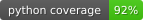
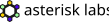

<p align="center">
  
</p>

<p align="center">
  
  
  
  
  <a href="https://github.com/facebook/openzl">
    
  </a>
</p>

## What is GeoZL?

[OpenZL](https://github.com/facebook/openzl) represents compression as a graph of codecs. GeoZL adds raster-aware nodes for numeric tiles, like spatial predictors, NoData handling and bounded-error quantizers.

## Status

GeoZL codecs and frames are ready for production use. Frames written by 0.14.0
are the compatibility baseline. The C source API is stable; the Python API and
C ABI may evolve before 1.0. See [compatibility](docs/compatibility.md).

Wheels are available for Linux x86-64 and macOS arm64.

## Install

```bash
pip install geozl
```

## Quick start

`profile` ranks candidate graphs. Build the best one once, then reuse it across
tiles.

```python
import numpy as np
import geozl

y, x = np.mgrid[0:1024, 0:1024]
tile = (2000 + 8 * y + 5 * x).astype(np.uint16)      # a raster, not noise

rows = geozl.profile(tile)
print(rows)
best = rows[0]["graph"]

g = geozl.graph(tile, best)
frame = geozl.compress(tile, graph=g)

back = geozl.decompress(frame)
back = back.view(np.uint16).reshape(1024, 1024)
```

`decompress` returns a flat `uint8` array; restore its dtype and shape as above.
The [Python API guide](docs/api-high.html) covers graph options, lossy recipes
and checksum control.

### Lossy and NoData

```python
absolute = geozl.graph(tile, best, error=2)
relative = geozl.graph(tile, best, error="1%")

holed = tile.astype(np.float32)
holed[::7, ::5] = -9999
masked = geozl.graph(holed, best, nodata=-9999)
```

Build lossy graphs from representative data; tiles outside that range are
rejected. `error=None` and `error=0` are lossless. Full `LINEAR`, `LOG`
and `SQRT` recipes remain available for advanced use. A NoData sentinel must
fit the array dtype.

## R

[bindings/r](bindings/r/README.md) holds an R package with the same graph,
compress, decompress and profile calls. It builds GeoZL and OpenZL from source
with CMake and writes the same frames as Python.

```r
library(geozl)

tile <- outer(1:1024, 1:1024, function(x, y) 2000 + 5 * (x - 1) + 8 * (y - 1))
g <- geozl_graph(tile, "planar>zigzag>pfor", datatype = "uint16")
frame <- geozl_compress(tile, g)
back <- geozl_decompress(frame, "uint16", dim = dim(tile))
```

## Julia

[bindings/julia](bindings/julia/README.md) holds GeoZL.jl, with the same calls
on Julia's native element types. It writes the same frames as Python and R.

```julia
using GeoZL

tile = [UInt16(2000 + 5 * (x - 1) + 8 * (y - 1)) for x in 1:1024, y in 1:1024]
g = GeoZL.graph(tile, "planar>zigzag>pfor")
frame = GeoZL.compress(tile, g)
back = GeoZL.decompress(UInt16, frame, size(tile)...)
```

## Low-level API

For custom graphs, use nodes from `geozl.lossless` and `geozl.lossy` with
`openzl.ext`. Call `geozl.register_decoders(dctx)` when managing your own
OpenZL decoder.

## Codecs

| codec           |       CTid | what it does                                                       |
| --------------- | ---------: | ------------------------------------------------------------------ |
| `delta_w`       | `0x72D701` | residual against the west neighbour                                |
| `delta_n`       | `0x72D702` | residual against the north neighbour                               |
| `planar`        | `0x72D703` | predicts each pixel from `W + N - NW`                              |
| `deinterleave`  | `0x72D704` | separates a two-lane interleaved stream                            |
| `med`           | `0x72D705` | median edge detector predictor                                     |
| `average`       | `0x72D706` | floor average of the west and north neighbours                     |
| `wp_static`     | `0x72D707` | fits a weighted predictor and stores its weights in the frame      |
| `nodata`        | `0x72D70C` | moves missing samples into a validity mask and fills the holes     |
| `pfor`          | `0x72D70D` | bit packs each block of 256 and patches the values that overflow   |
| `planar_zigzag` | `0x72D70F` | fuses planar residuals and Zigzag without an intermediate stream   |
| `planar_zigzag_pfor` | `0x72D710` | the whole planar, Zigzag and PFOR chain as one numeric-to-serial codec |
| `med_zigzag`    | `0x72D711` | fuses MED residuals and Zigzag without an intermediate stream      |
| `planar_zigzag_pivco` | `0x72D712` | planar and Zigzag, then PivCo Huffman or byte PFOR per residual byte lane |
| `quant_linear`  | `0x72D781` | uniform grid with a fixed absolute bound: `LINEAR:MAX_ERROR=V`     |
| `quant_log`     | `0x72D782` | logarithmic grid with a relative bound: `LOG:MAX_ERROR=P%`         |
| `quant_sqrt`    | `0x72D783` | square-root grid whose bound grows with noise: `SQRT:MAX_ERROR=VN` |

## AI agent skill

Install the [GeoZL skill](https://github.com/asterisk-labs/geozl/blob/main/.claude/skills/geozl/SKILL.md) so coding agents know its graph recipes, bounded-error rules and codec internals.

```bash
npx skills add asterisk-labs/geozl
```

## Development

Local builds require Python 3.11+, a C11 compiler, Git, Make, CMake and Ninja.

```bash
python -m pip install cmake ninja numpy cffi openzl pytest ruff mypy
make submodules
make python FULL=ON
make test
ruff check .
mypy
```

`make help` lists the other build variants.

For R, `make r` tests the package from the checkout and `make r-check` runs
`R CMD check` on its source package. For Julia, `make julia` tests GeoZL.jl
against the library this checkout builds.

For wasm64, activate Emscripten and run `make wasm-test`. The generated ES
module and JavaScript API are documented in [tools/wasm](tools/wasm/README.md).

## License

BSD-3-Clause

<div align="center">
  <br>
  Made with &#9829; by
  <br><br>
  <a href="https://asterisk.coop">
    
  </a>
</div>
